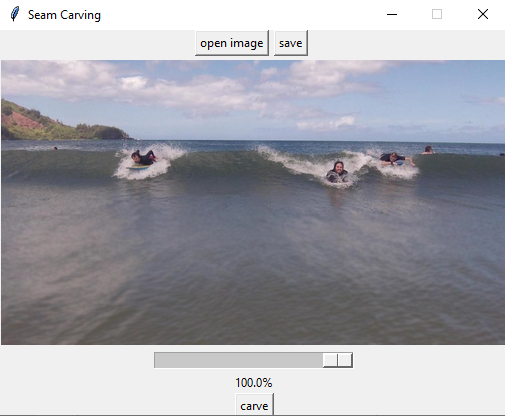
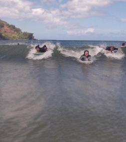
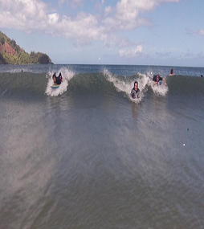

# Seam-Carving
A visualization and GUI of the seam carving algorithm for content aware image resizing. This is a project to explore a real life implementation of dynamic programming and to visualize code using tkinter GUIs in python. Seams are calculated by calculating an energy matrix for each pixel in the image and then using dynamic programming to find the least cost seam down the height of the image before removing the seam. A previous version of the code used Dijkstra's algorithm to find the shortest path, but I find that dynamic programming yields slightly better run times.

## GUI Buttons
The GUI preloads a default image but allows users to upload and save custom images after resizing. A slider controls the desired size of resizing as a percentage. "Carve" starts the main algorithm. 

```
python CarveVisualizer.py
```


## Resizing Images
Below is a resizing demo to 50% of original image width


We can see that the people, clouds, and mountains in the background are undistorted. Most of the pixels removed were from the sky or ocean, which results in a natural looking resizing of the image. This is a drastic difference than simply shrinking the image by 50% with regular editors.

 
